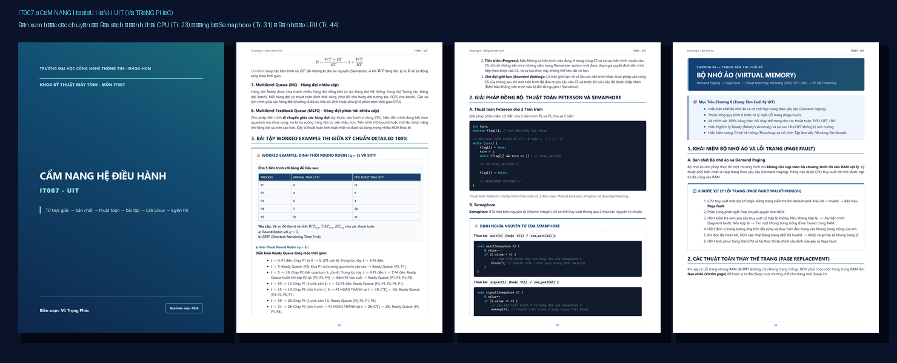
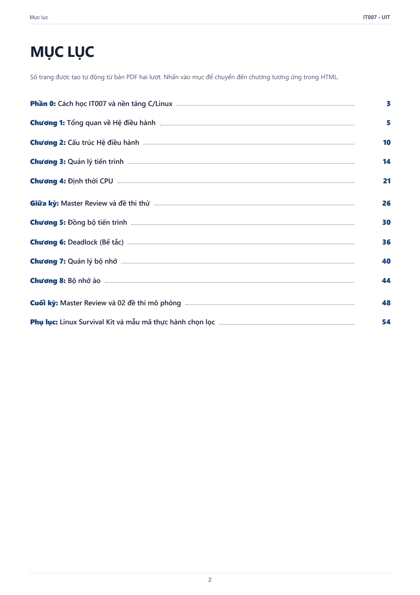

# IT007 — CẨM NANG HỆ ĐIỀU HÀNH UIT
### Từ trực giác → bản chất → thuật toán → bài tập → Lab Linux → luyện thi

**Tác giả / Biên soạn:** Võ Trọng Phúc  
**Môn học:** IT007 – Hệ điều hành (Khoa Kỹ thuật Máy tính, Trường ĐH Công nghệ Thông tin – ĐHQG-HCM)  
**Ấn bản:** v1.0 • 56 trang A4 • Chuẩn PDF In ấn & Bản HTML Tự chứa Ngoại tuyến  

---

<div align="center">

[](dist/IT007_CamNang_HeDieuHanh_UIT_VoTrongPhuc_FINAL.pdf)
[](dist/IT007_CamNang_HeDieuHanh_UIT_VoTrongPhuc_FINAL.html)
[](#)

</div>

---

## Giới thiệu tổng quan

**IT007 – Cẩm nang Hệ điều hành UIT** là tài liệu hệ thống hóa toàn diện, được thiết kế chuyên biệt cho sinh viên UIT học tập và luyện thi học phần Hệ điều hành (IT007). 

Tài liệu được xây dựng theo phương pháp sư phạm 11 bước: đi từ **Trực giác đời sống $\rightarrow$ Bản chất kiến trúc phần cứng $\rightarrow$ Cơ chế hoạt động $\rightarrow$ Bài tập từng bước $\rightarrow$ Cảnh báo bẫy thi $\rightarrow$ Thực hành Linux/C $\rightarrow$ Ôn tập nhanh 1 trang**.

> [!NOTE]
> Đây là tài liệu học tập được biên soạn độc lập bởi sinh viên, không phải là ấn phẩm phát hành chính thức của Trường Đại học Công nghệ Thông tin – ĐHQG-HCM.

<div align="center">
  
</div>

---

## Điểm nổi bật của Cẩm nang

- **Hiểu bản chất trước, Công thức sau**: Giải thích trực quan cách CPU, RAM và thanh ghi phần cứng phối hợp xử lý thay vì chỉ học thuộc lòng định nghĩa.
- **Bài tập tính toán có lời giải từng bước**:
  - **Định thời CPU**: Sơ đồ Gantt chi tiết cho FCFS, SJF, SRTF, Priority, Round Robin ($q=5, q=3$), HRRN, Multilevel Queue (MQ), MLFQ.
  - **Đồng bộ tiến trình**: Phân tích chi tiết Peterson, Hardware TestAndSet/Swap, Semaphore, Monitor, Memory Barrier, Producer-Consumer, Readers-Writers, Dining Philosophers.
  - **Deadlock & Thuật toán Banker**: Dựng ma trận $Need$, bảng diễn tiến véc-tơ $Work$, xác định chuỗi an toàn (Safe Sequence) và xử lý yêu cầu cấp phát.
  - **Phân trang & Bộ nhớ ảo**: Tính địa chỉ vật lý, bảng trang, tính thời gian truy xuất hiệu dụng (EAT) với TLB, và bảng nạp 20 bước cho FIFO, OPT, LRU (kèm giải thích hiện tượng Belady & Thrashing).
- **Phân tích bẫy đề thi (Exam Traps)**: Hơn 25 hộp cảnh báo các lỗi kinh điển sinh viên hay mất điểm trong đề thi trắc nghiệm và tự luận UIT.
- **Hệ thống ôn thi Master Review**: Bao gồm 01 đề thi giữa kỳ và 02 đề thi mô phỏng cuối kỳ chuẩn định dạng thi UIT kèm đáp án chi tiết 100%.
- **Phụ lục thực hành Linux (Survival Kit)**: Hướng dẫn lệnh cốt lõi và các mẫu mã chọn lọc cho chủ đề POSIX Threads, `fork()`, `pipe()`, shared memory và signal. Đây không phải bộ mã nguồn hoàn chỉnh cho toàn bộ Lab 1–6.
- **Độc lập ngoại tuyến 100%**: Sử dụng thư viện MathJax 3.2.2 đóng gói sẵn để hiển thị 771 công thức toán học sắc nét mà không cần kết nối mạng.

---

## Nội dung chi tiết 12 chương

<div align="center">
  
</div>

| Phần / Chương | Tên chuyên đề | Nội dung trọng tâm | Trang |
| :--- | :--- | :--- | :---: |
| **Phần 0** | Cách học IT007 & Nền tảng | Bản đồ môn học, kỹ năng C (con trỏ, struct), POSIX API và cấu trúc đề thi | 3–4 |
| **Chương 1** | Tổng quan về Hệ điều hành | Khái niệm HDH, Dual-mode (User vs Kernel), ngắt phần cứng, Trap/Exception | 5–8 |
| **Chương 2** | Cấu trúc Hệ điều hành | Lời gọi hệ thống (System Call), truyền tham số, cấu trúc Monolithic vs Microkernel | 9–12 |
| **Chương 3** | Quản lý tiến trình | PCB, 5 trạng thái tiến trình, cây `fork()`, luồng (Threads vs Process) | 13–19 |
| **Chương 4** | Định thời CPU | Các chỉ số $TAT, WT, RT$, thuật toán FCFS, SJF, SRTF, Priority, RR, HRRN, MLFQ | 20–24 |
| **Giữa kỳ** | Midterm Master Review | Đề thi mẫu giữa kỳ kèm lời giải chi tiết và biểu đồ Gantt Round Robin $q=3$ | 25–28 |
| **Chương 5** | Đồng bộ tiến trình | Race Condition, Critical Section, Peterson, Semaphore, Mutex, Monitor, 3 bài toán kinh điển | 29–34 |
| **Chương 6** | Deadlock (Bế tắc) | 4 điều kiện Coffman, đồ thị RAG, thuật toán Banker (Need, Work, Safe State), Phòng tránh & Phục hồi | 35–38 |
| **Chương 7** | Quản lý bộ nhớ | Dynamic Relocation, Phân mảnh nội/ngoại, First/Best/Worst fit, Phân trang, TLB, EAT | 39–42 |
| **Chương 8** | Bộ nhớ ảo | Demand Paging, Page Fault step-by-step, thuật toán FIFO, OPT, LRU, Belady, Thrashing | 43–46 |
| **Cuối kỳ** | Final Master Review | 02 Đề thi mô phỏng cuối kỳ chuẩn format UIT kèm đáp án chi tiết 100% | 47–52 |
| **Phụ lục** | Linux Survival Kit | Lệnh Linux cơ bản, hướng dẫn Shell/Bash và mẫu mã thực hành chọn lọc | 53–56 |

---

## Đọc tài liệu

- **Bản PDF in ấn chính thức:** [`dist/IT007_CamNang_HeDieuHanh_UIT_VoTrongPhuc_FINAL.pdf`](dist/IT007_CamNang_HeDieuHanh_UIT_VoTrongPhuc_FINAL.pdf) (56 trang A4, định dạng đẹp nhất).
- **Bản HTML đơn nhất ngoại tuyến:** [`dist/IT007_CamNang_HeDieuHanh_UIT_VoTrongPhuc_FINAL.html`](dist/IT007_CamNang_HeDieuHanh_UIT_VoTrongPhuc_FINAL.html) (Mở trực tiếp trên mọi trình duyệt web không cần Internet).

---

## Cấu trúc thư mục kho lưu trữ

```
HDH_UIT/
├── README.md               # Trang giới thiệu và hướng dẫn tổng quan
├── NOTICE.md               # Thông báo bản quyền và miễn trừ trách nhiệm
├── CHANGELOG.md            # Lịch sử các phiên bản phát hành
├── .gitignore              # Bộ lọc tệp tin không theo dõi Git
├── PROJECT_STATE.md        # Nhật ký trạng thái dự án
├── TODO.md                 # Danh mục kiểm tra tiến độ
├── QA_LOG.md               # Bảng điểm và nhật ký bảo đảm chất lượng
├── SOURCE_MANIFEST.md      # Kiểm kê phân loại toàn bộ nguồn tài liệu
├── RELEASE_CHECKLIST.md    # Danh mục kiểm soát tiêu chuẩn phát hành
│
├── src/                    # Mã nguồn cẩm nang
│   ├── chapters/           # 12 tệp HTML từng chương độc lập
│   ├── styles/             # Động cơ in ấn CSS A4 (components, print, publication)
│   └── vendor/mathjax/     # Thư viện MathJax 3.2.2 phục vụ hiển thị công thức offline
│
├── dist/                   # Sản phẩm phát hành chính thức
│   ├── IT007_CamNang_HeDieuHanh_UIT_VoTrongPhuc_FINAL.html
│   └── IT007_CamNang_HeDieuHanh_UIT_VoTrongPhuc_FINAL.pdf
│
├── docs/                   # Tài liệu hướng dẫn & hình ảnh xem trước
│   ├── preview/            # Bộ ảnh xem trước chất lượng cao (cover, toc, sample pages)
│   ├── research/           # Tài liệu nghiên cứu học thuật nền tảng (Curriculum, Exam, Lab maps)
│   ├── BUILD.md            # Hướng dẫn biên dịch và tái lập bản PDF
│   ├── METHODOLOGY.md      # Khung phương pháp sư phạm 11 bước
│   └── PROJECT_HISTORY.md  # Lịch sử hoàn thiện dự án qua các giai đoạn
│
├── scripts/                # Bộ công cụ tự động hóa & kiểm thử
│   ├── build.js / build.ps1# Pipeline biên dịch HTML/PDF 2 lượt
│   ├── pdf_tools.py        # Công cụ xử lý PDF và tạo TOC
│   ├── technical_checks.py # Bộ kiểm thử tính toán thuật toán tự động
│   ├── validate.py / ps1   # Bộ kiểm thử tính toàn vẹn kho lưu trữ
│   └── generate_previews.py# Script trích xuất ảnh xem trước từ PDF
│
├── reports/                # Báo cáo kiểm toán chất lượng
│   ├── FINAL_QA_REPORT.md  # Báo cáo kiểm toán xuất bản đạt 96/100
│   └── PRE_CODEX_AUDIT.md  # Báo cáo kiểm toán trước bàn giao đạt 99.5/100
│
└── .github/workflows/      # Tự động hóa CI với GitHub Actions
    └── validate.yml        # Workflow kiểm thử kho lưu trữ khi push
```

---

## Hướng dẫn kiểm thử và biên dịch từ nguồn

### 1. Yêu cầu cài đặt
- Python 3.10 trở lên, Node.js 18 trở lên và Chrome hoặc Edge cài cục bộ.
- Cài Node dependency một lần: `npm ci` (hoặc `npm install` khi phát triển).
- Cài đặt thư viện Python:
  ```bash
  pip install pypdf pdfplumber reportlab pillow pypdfium2
  ```

### 2. Chạy bộ kiểm thử tự động (Validation Suite)
```bash
python scripts/validate.py
```

### 3. Biên dịch lại toàn bộ sách (Two-Pass PDF Build)
```powershell
powershell -ExecutionPolicy Bypass -File .\scripts\build.ps1
```

Xem hướng dẫn chi tiết tại [docs/BUILD.md](docs/BUILD.md).

---

## Tác giả & Đóng góp

- **Biên soạn & Hệ thống hóa:** Võ Trọng Phúc  
- **Kho lưu trữ GitHub:** [https://github.com/Phuchello/HDH_UIT](https://github.com/Phuchello/HDH_UIT)  
- **Bản quyền nội dung:** Copyright © 2026 Võ Trọng Phúc. Mọi quyền được bảo lưu theo quy định tại [NOTICE.md](NOTICE.md).

---

## Tuyên bố miễn trừ trách nhiệm (Disclaimer)

Tài liệu được biên soạn độc lập nhằm mục đích phi thương mại phục vụ học tập, nghiên cứu và ôn thi học phần Hệ điều hành (IT007) của sinh viên. Mọi thông tin tham khảo từ slide giảng dạy và đề cương đều thuộc quyền sở hữu của Trường Đại học Công nghệ Thông tin – ĐHQG-HCM.
